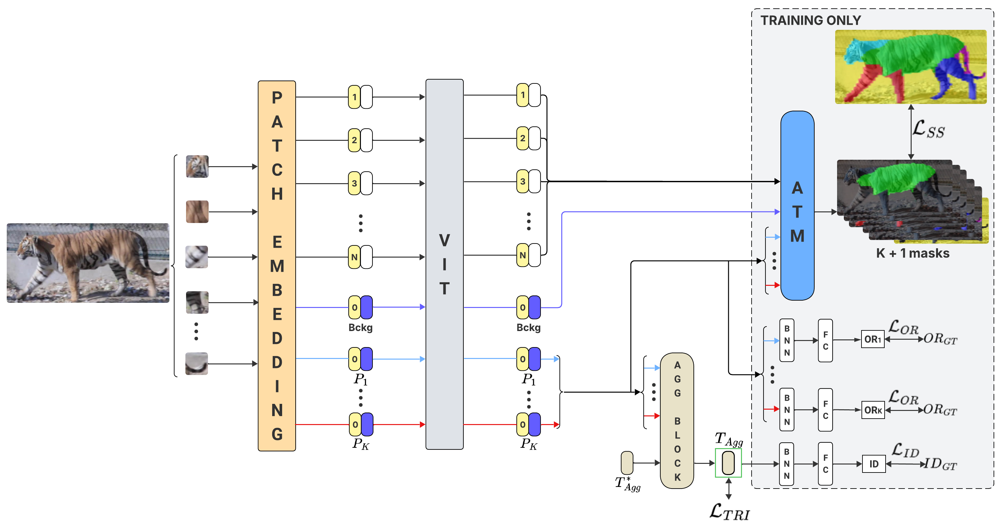

# PAW-ViT

This is the code implementation of PAW-ViT (Part-AWare animal re-identification ViT) presented in the paper **An improved architecture for part-based animal re-identification through semantic segmentation distillation**, accepted to WACV 2026.

The code to generate the semantic segmentation pseudo-masks is inside the folder `mask_generation`. You need the masks to train PAW-ViT, but they are not necessary for inference.
  

## Table of Contents

- [Overview](#overview)

- [Datasets](#datasets)

- [Setup](#setup)

- [Weights](#weights)

- [Training](#training)

- [Evaluation](#evaluation)

- [Acknowledgement](#acknowledgement)

- [Citation](#citation)

  
---

## Overview

PAW-ViT (Part-AWare animal re-identification Vision Transformer) is a modified [ViT](https://github.com/google-research/vision_transformer) for animal re-identification. It replaces the standard classification token with K learnable part tokens, including a background token. Each token specializes to a specific anatomical region of the animal. Spatial specialization is achieved via feature-based knowledge distillation by training each token’s attention to image patches to produce a semantic segmentation mask. Part tokens are additionally supervised with individual orientation losses. An aggregation block pools the K-1 part tokens, excluding the background, into a single aggregation token. This token in supervised with triplet and cross-entropy losses for animal re-identification.

## Datasets

To use a dataset, you need to first specify its path in the config file parameter `ROOT`. To train PAW-ViT, you also need a folder with the semantic segmentation masks, set the name of the folder in the parameter `MASK_DIR`. PAW-ViT training requires semantic segmentation masks.

The code and dependencies used to generate the masks are inside the folder `mask_generation`.

  

Because of supplementary material size limits, we will release the masks and the mask generation code upon acceptance.

We use two datasets in our paper, they are both third-party:

  

**ATRW (Amur Tiger Re-identification in the Wild):**

The dataset can be found at [https://cvwc2019.github.io/challenge.html](https://cvwc2019.github.io/challenge.html).

Expected structure and files for training/testing are in the folder: `pose_datasets/atrw`. Add the path to the annotation file gt_test_plain.json to the configuration file variable `GT_LABELS_PATH`.

As described in the paper, we double the training set by horizontally flipping all images.

  

**YAKReID-103:**

Access is granted by contacting the authors of [YakReID-103: A Benchmark for Yak Re-Identification](https://ieeexplore.ieee.org/document/9484341).

Expected structure and files for training/hard-testing are in the folder: `pose_datasets/YakReID-103`. The files for the subset of simple-testing are in the folder `pose_datasets/YakReID-103_simple`. 

As described in the paper, we double the training set by horizontally flipping all images.

  

## Setup

### Libraries

We trained our models using python 3.10.4 using torch 2.2.0 and cuda 12.1. We recommend using either Python's `venv` or [conda](https://docs.conda.io/projects/conda/en/latest/user-guide/getting-started.html) to create your environment.

  

1.  **Set up your environment**

Create your Python environment using `venv`:

`python -m venv env_pawvit`

  

or [conda](https://docs.conda.io/projects/conda/en/latest/user-guide/getting-started.html):

`conda create --name env_test python=3.10.4 -y`

  
  

2.  **Install the dependencies**

Download the libraries using the command `pip install -r requirements.txt`.

  

If torch does not work, download it directly through the command:

`pip install torch==2.2.0 torchvision==0.17.0 torchaudio==2.2.0 --index-url https://download.pytorch.org/whl/cu121`

Alternatively, search for your preferred library version in the [Pytorch website](https://pytorch.org/get-started/previous-versions/).

  

## Weights

The model trained weights surpass the limits of supplementary material and will be provided under acceptance.

The pre-trained weights of PAW-ViT are downloaded automatically by the code, but can be found at: [ViT-Base](https://github.com/rwightman/pytorch-image-models/releases/download/v0.1-vitjx/jx_vit_base_p16_224-80ecf9dd.pth). The pre-trained weights must be placed in the folder "models/weights".

  

## Training

  

To train the model, run the command:

python main.py --config=[CONFIG PATH]

Make sure to adjust the training parameters in the configuration files inside the folder "configs" as needed. One can also do an hyper-parameter tuning by setting the parameter `HP_PARAMETERS`to true.

  

## Evaluation

To skip training and directly evaluate a model, set the `TEST_ONLY` parameter of the configuration file to `True`. To load a model, set the parameter `LOAD_MODEL` and specify the path to the weights file in `WEIGHTS_PATH`.

## Acknowledgements

We would like to thank the following repositories:

- [TransReID](https://github.com/damo-cv/TransReID/tree/main)
- [pytorch-image-models](https://github.com/huggingface/pytorch-image-models)
- [AmurTigerReID](https://github.com/liuning-scu-cn/AmurTigerReID)
- [ATRWEvalScript](https://github.com/cvwc2019/ATRWEvalScript)
- [MMPose](https://github.com/open-mmlab/mmpose)

## Citation

If you use this work, please cite:
